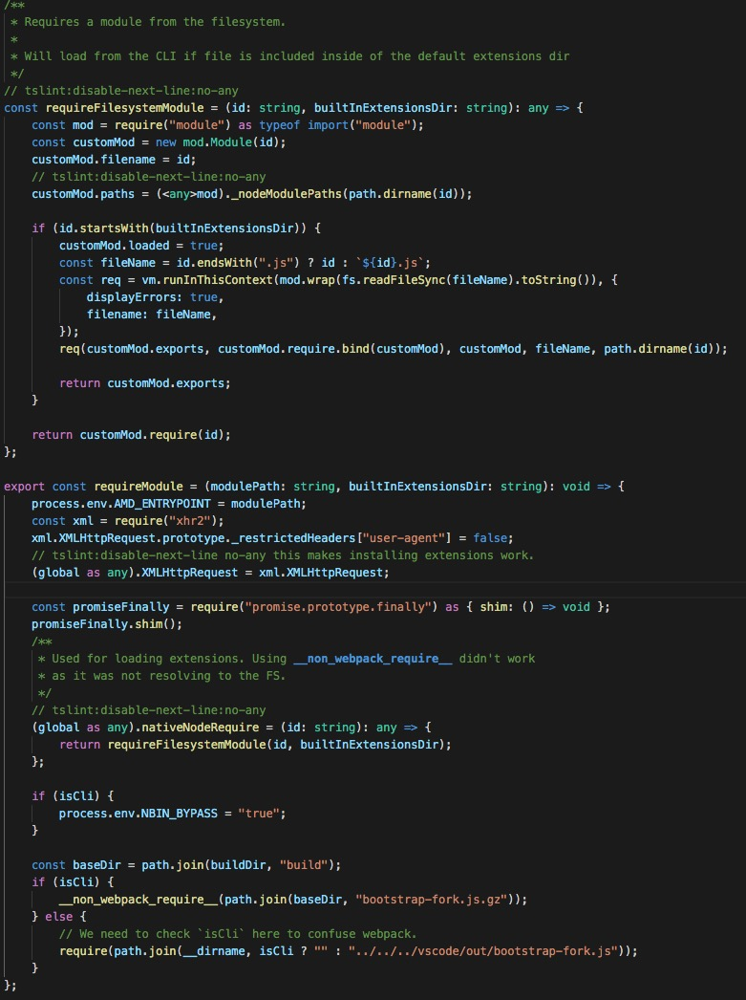
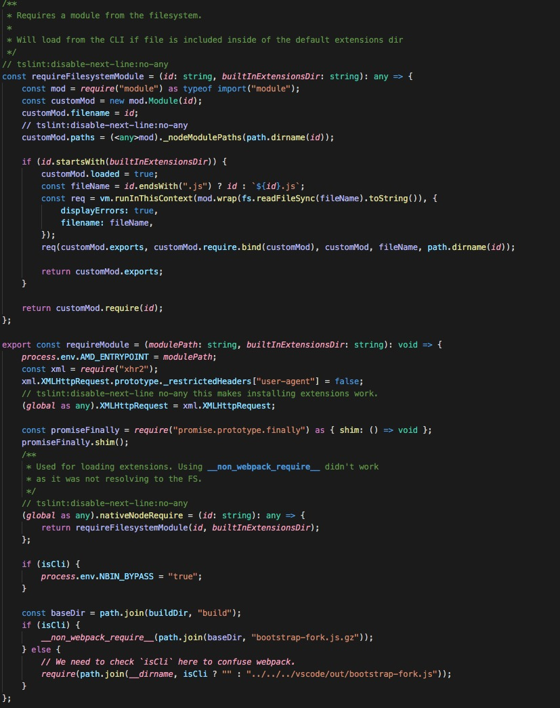

# Semantic Highlight for TypeScript

TypeScript 语义化高亮 VS Code 插件
## Features
* TypeScript/TypeScript-React 文件(枚举, 方法参数, 局部变量)语义化高亮
* JavaScript/JavaScript-React 文件(方法参数, 局部变量)语义化高亮

VS Code 默认高亮

语义化高亮

## Extension Settings

## Known Issues

* 修改文本不会触发高亮更新

## Release Notes

### 0.0.1
基本功能实现

### 0.0.2
添加 didchange 事件

### 0.0.3
缓存已有的高亮信息

### 0.0.4
支持增量着色
-----------------------------------------------------------------------------------------------------------

**Enjoy!**
